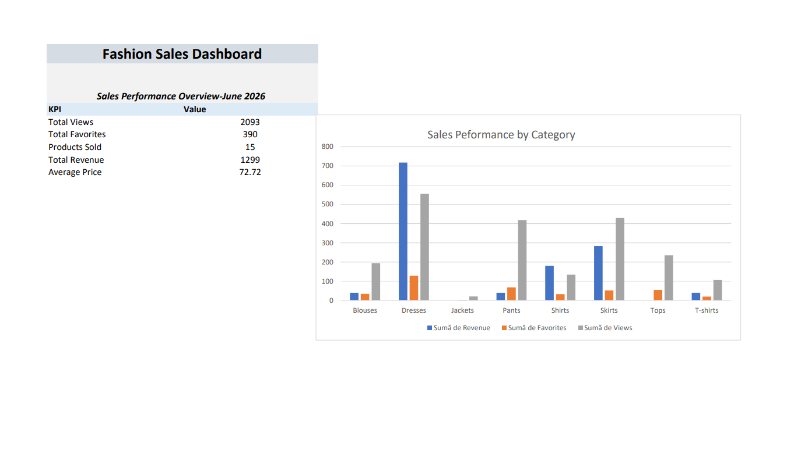

This Excel dashboard analyze fashion product performance using Pivot Tables, Pivot Charts and KPI metrics
## Key metrics
-Total revenue
-Total Views
-Total Favorites
-Average Price
## Tools Used
-Microsoft Excel
-Pivot Tables
-Pivot Charts
-KPI Reporting
## Dashboard Preview

